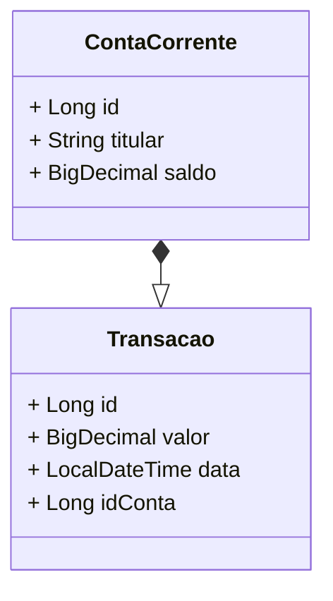

# API que simula saques e recebimentos

## Diagrama de classes

```mermaid
classDiagram
class ContaCorrente {
+ Long id
+ String titular
+ BigDecimal saldo
}

class Transacao {
+ Long id
+ BigDecimal valor
+ LocalDateTime data
+ Long idConta
}

ContaCorrente *--|> Transacao
```